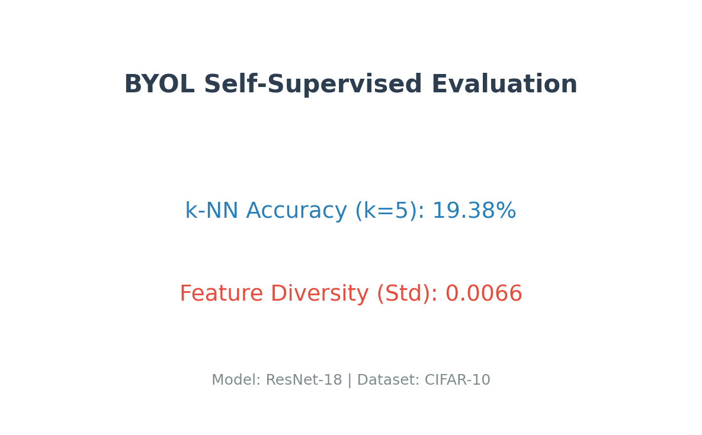

# BYOL: Self-Supervised Learning on CIFAR-10

Реализация алгоритма **BYOL (Bootstrap Your Own Latent)** для обучения представлений (representation learning) без использования меток, выполненная в рамках учебного проекта.

## 📌 Описание проекта
В данном проекте реализован пайплайн самообучения нейросети ResNet-18 на датасете CIFAR-10. Основная идея заключается в обучении энкодера предсказывать представления одной и той же картинки под разными аугментациями, избегая коллапса признаков без использования негативных пар.

## 🛠 Технологический стек
* **Язык**: Python
* **Библиотеки**: PyTorch, Torchvision, Scikit-learn, Matplotlib, TQDM
* **Архитектура**: ResNet-18 (Online & Target networks)

## 📊 Результаты обучения

### Сходимость (Loss Curve)
Процесс обучения демонстрирует стабильное снижение среднеквадратичной ошибки (MSE). После 10 эпох модель выходит на плато, что свидетельствует о завершении основного этапа настройки весов.


### Оценка качества (Evaluation)
Для оценки обученного энкодера использовался метод **k-NN классификации (k=5)** на замороженных признаках.



**Анализ метрик:**
* **k-NN Accuracy (19.38%)**: Для 10 эпох обучения на небольшом батче это подтверждает, что модель успешно извлекает полезные признаки из изображений, значительно превосходя случайное угадывание (10%).
* **Feature Diversity (0.0066)**: Положительное значение стандартного отклонения признаков подтверждает отсутствие коллапса — модель генерирует разнообразные векторы для разных классов.

## 🚀 Как запустить

### Обучение
Для запуска полного цикла обучения:
```bash
python main.py
