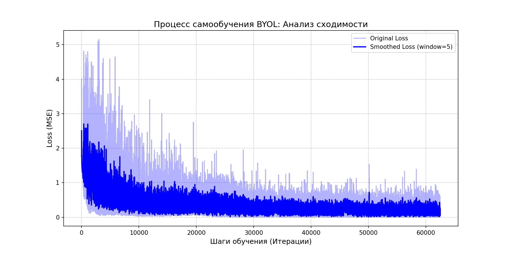

# BYOL_test_project_MEPhI

Markdown

# Реализация алгоритма BYOL (Bootstrap Your Own Latent) на PyTorch

Данный проект представляет собой имплементацию метода самообучения (Self-Supervised Learning) **BYOL**, предложенного DeepMind. Обучение проведено на датасете **CIFAR-10** с использованием архитектуры **ResNet-18**.

Проект выполнен в рамках учебной программы НИЯУ МИФИ.

## 🚀 Особенности проекта

- **Без негативных примеров**: В отличие от SimCLR, BYOL не требует контрастных пар, что снижает требования к размеру батча.
- **Модульная структура**: Код разбит на логические блоки (модель, аугментации, обучение, визуализация).
- **Реальные данные**: Обучение проведено на полноценном датасете CIFAR-10.
- **Сглаживание Loss**: Использование скользящего среднего для анализа сходимости в условиях шума.

## 🛠 Структура репозитория

* `model.py` — конфигурация энкодера (ResNet) и проектора.
* `augmentations.py` — пайплайн двойных аугментаций (Color Jitter, Gaussian Blur, Solarization).
* `main.py` — основной тренировочный цикл и загрузка данных.
* `visualize.py` — инструменты для построения графиков обучения.
* `requirements.txt` — список необходимых зависимостей.

## 📈 Результаты обучения

Ниже представлен график функции потерь (MSE) в процессе обучения на 60,000+ итерациях. Синяя линия показывает сглаженный тренд (Moving Average), светло-голубая — сырые данные.

<p align="center">
  
</p>

**Вывод:** Модель демонстрирует стабильную сходимость. Характерные «пики» на графике соответствуют обработке сложных аугментированных пар, после которых система успешно восстанавливается, выходя на новые локальные минимумы.

## 💻 Инструкция по запуску

 **Клонирование репозитория:**
   ```bash
   git clone [https://github.com/lxej/BYOL_test_project_MEPhI.git](https://github.com/lxej/BYOL_test_project_MEPhI.git)
   cd BYOL_test_project_MEPhI

    Установка зависимостей:
    Bash

    pip install -r requirements.txt

    Запуск обучения:
    Bash
    python main.py

    Датасет CIFAR-10 будет скачан автоматически при первом запуске.

📚 Ссылки

    Оригинальная статья: Bootstrap Your Own Latent: A New Approach to Self-Supervised Learning

    Библиотека: byol-pytorch
